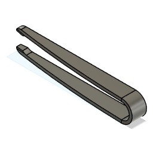

# Daniel's Tinekerbox

### This Project Holds a selection of designs I made during the course Designing for 3D printing from Udemy.
#### I used AutoDesk Fusion 360.

#### ! [Link to Course](https://www.udemy.com/course/designing-for-3d-printing-with-fusion-360)

#### !! Tweezers !!

[Fusion 360 libray link](https://a360.co/4mU547M)

##### - [] Printed
